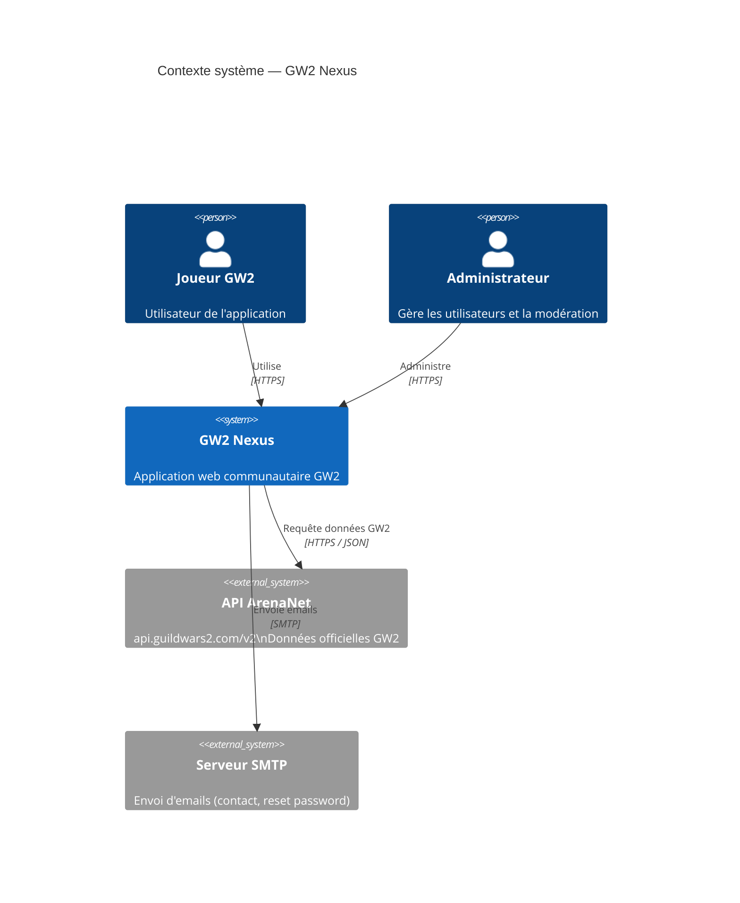
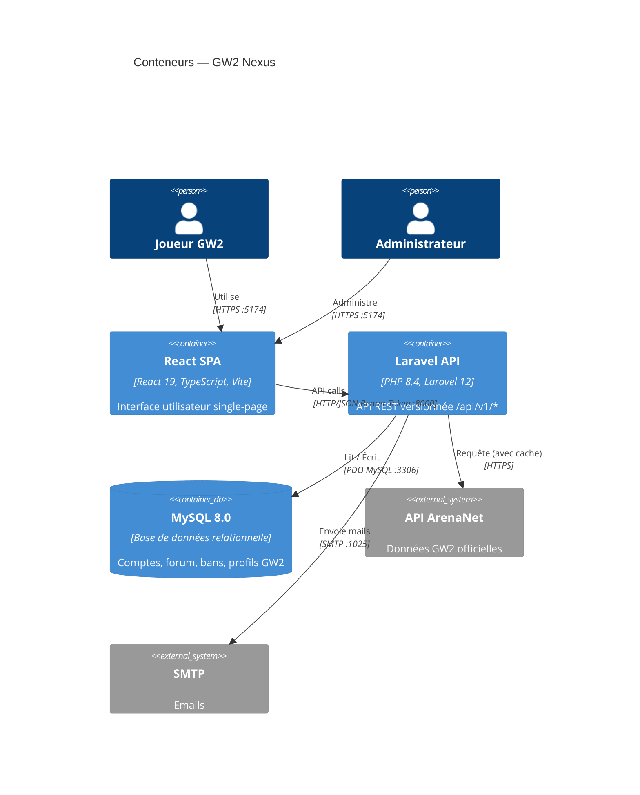
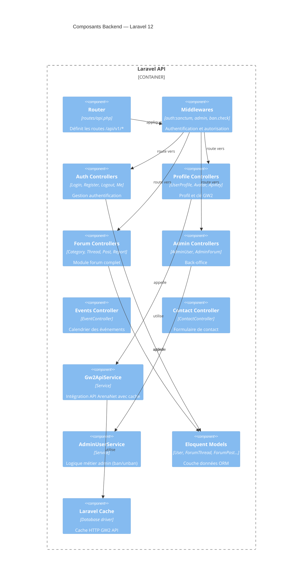
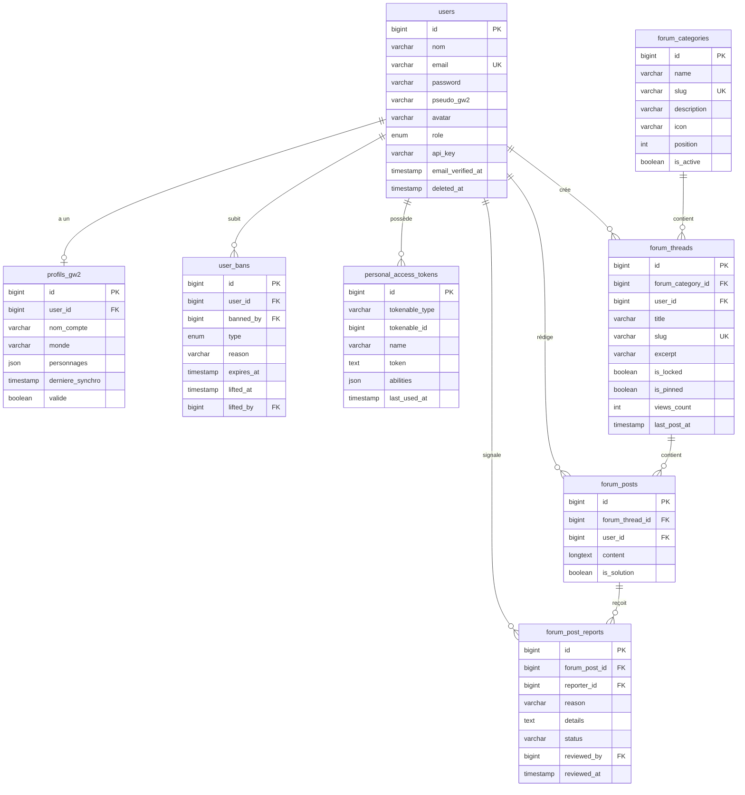
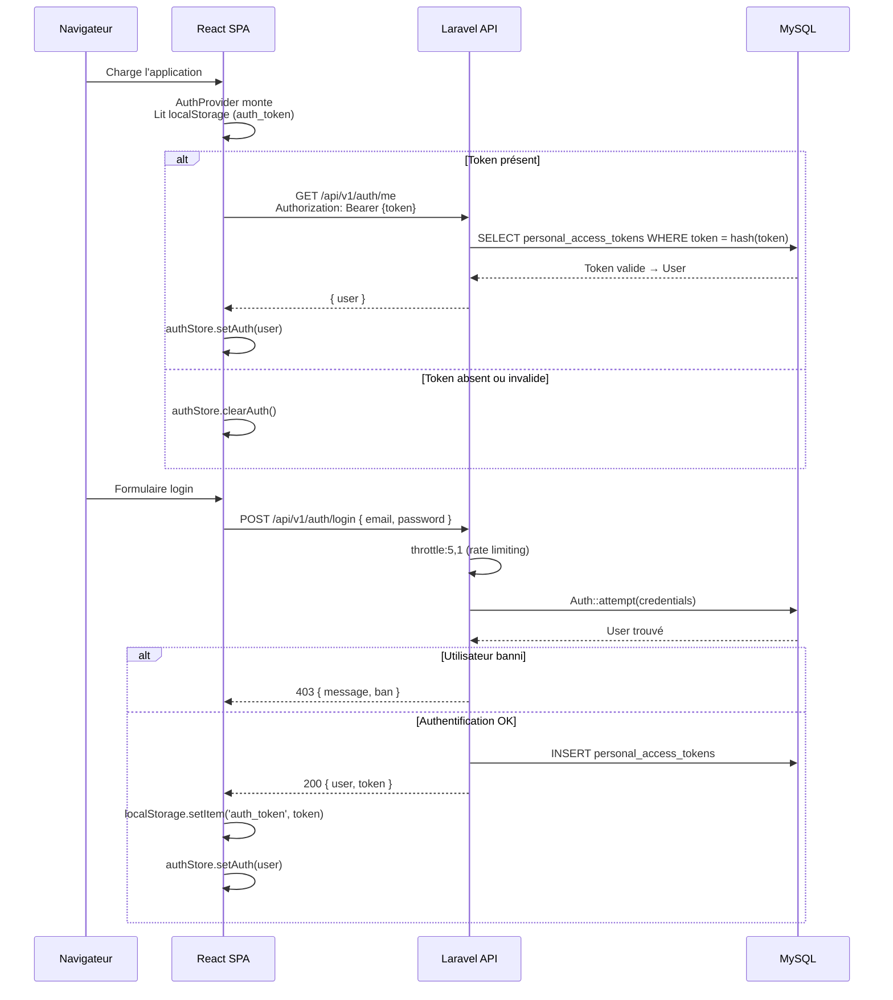
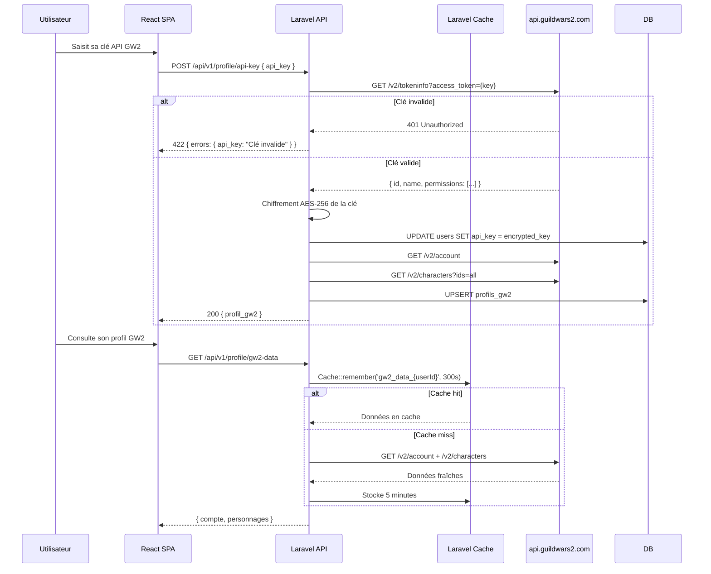
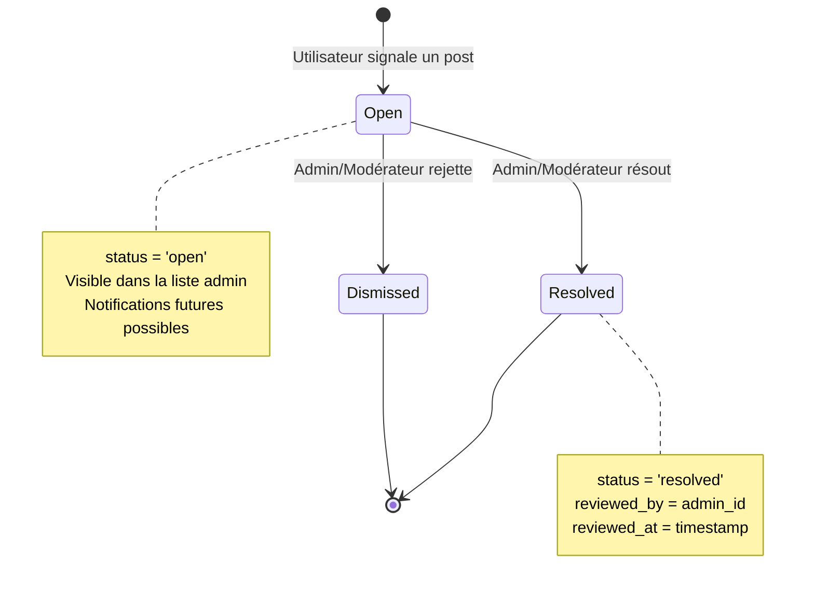

# Diagrammes d'Architecture — GW2 Nexus

Tous les diagrammes sont en syntaxe **Mermaid** (rendu natif dans GitHub, GitLab, Notion, Obsidian).

---

## C4 Niveau 1 — Contexte système

---

## C4 Niveau 2 — Conteneurs

---

## C4 Niveau 3 — Composants Backend

---

## Schéma de la base de données

---

## Flux d'authentification

---

## Flux de synchronisation GW2

---

## Flux de modération forum

---

## Outils recommandés

| Diagramme | Outil | Format |
|---|---|---|
| Architecture C4 | Structurizr, C4-PlantUML | DSL/PlantUML |
| ERD | dbdiagram.io, DBeaver | SQL/visuel |
| Séquences | Mermaid (natif GitHub) | Markdown |
| Infrastructure | draw.io / Excalidraw | Visuel |
| Flux React | React DevTools | Runtime |
